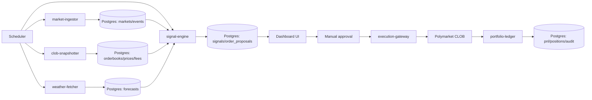
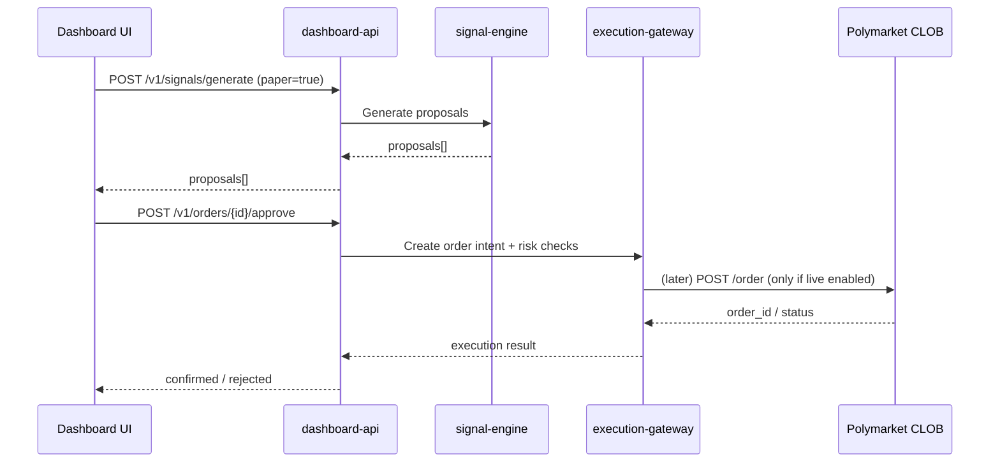

# Building a Polymarket Weather Trading Agent

## Executive summary

This report specifies a **paper-first Polymarket weather trading agent** that (a) ingests weather markets and order books, (b) turns forecasts into calibrated probabilities aligned to each market’s resolution rules, (c) generates **trade proposals** (not automatic trades), and (d) tracks simulated and real P/L with a complete audit trail. It is explicitly designed for **manual execution only at the start**, with a phased rollout to “assisted trading” and later “constrained automation”. citeturn6view2turn0search8turn11search4turn19search7turn9search12

A critical constraint for anyone building from London/UK: Polymarket’s official API documentation lists **GB (United Kingdom) as blocked for placing orders**, and provides a geoblock endpoint (`GET https://polymarket.com/api/geoblock`) that builders should call before any trading attempt. This does **not** prevent paper trading or market data ingestion, but it can prevent live order placement from your location. citeturn21view0turn6view1

Your edge will come from four drivers, in this order:

Forecast quality (calibrated probabilities > raw forecasts), rule-matching (resolution source fidelity), liquidity filtering (avoid bad fills and wide spreads), and risk control (size and exposure discipline, plus fees and operational guardrails). citeturn11search4turn11search6turn0search8turn3search23turn19search0

## Edge drivers that actually matter

This section is intentionally practical: what to implement, what to measure, and what to refuse to trade.

### Forecast quality

**Goal:** convert weather forecasts into **well-calibrated probabilities** for each outcome bucket (e.g., “17°C”, “18°C”, “72°F or higher”), not just point forecasts. citeturn0search8turn18search1

**Recommended starting approach**
- Use an **ensemble** (multiple members) when possible, because bucket markets are about the *distribution* of possible temperatures (uncertainty), not just the median. citeturn1search2  
- Start with a single provider for the MVP to reduce complexity, but design the system so you can add additional providers later.

**Beginner-friendly probability method**
- For each station/location and day:
  1. Obtain **N ensemble members** of daily maximum (or minimum) near the station (or an hourly series you reduce to max/min).
  2. Apply a simple **bias correction**: `corrected = raw + bias(station, lead_time)` where bias is learned from historical errors.
  3. Convert to bucket probabilities by counting ensemble members that fall into each bucket, optionally with smoothing. citeturn1search2turn1search22

**Where to get forecast data (primary sources)**
- entity["organization","NOAA","us weather agency"]: the National Weather Service (NWS) provides an open API with forecasts and observations at `api.weather.gov`, designed to be cache-friendly and using JSON-LD. citeturn0search3  
- NWS forecasts are issued on a grid; the docs describe the common “two-request” pattern using `/points` to map lat/lon to the forecast grid. citeturn0search6  
- NOAA Climate Data Online (CDO) offers station-based climate data via an API token with explicit rate limits (5 requests/sec and 10,000 requests/day per token). citeturn0search10  
- entity["organization","Met Office","uk weather agency"]: DataPoint Fair Use limits are documented (5,000 requests/day and 100 requests/minute under fair use; higher limits with paid plans). citeturn1search4  
- Met Office Weather DataHub requires an `apikey` header for API usage. citeturn1search8  
- entity["organization","ECMWF","weather forecast centre"]: ECMWF Open Data provides a subset of real-time forecast data governed by CC‑BY‑4.0 plus ECMWF terms of use. citeturn1search1turn1search5  
- entity["company","Open-Meteo","weather api platform"]: Open‑Meteo’s docs state they combine multiple national weather models, and they publish an Ensemble API and an archived Historical Forecast API useful for backtesting. citeturn1search6turn1search2turn1search22

**How to measure forecast quality**
- Use a calibration metric (Brier score / log loss) and bucket-level accuracy (did you put the most probability mass on the realised bucket). Pick one and track it weekly per station + lead time. (This is an internal metric; it should gate expanded trading later.)

### Rule-matching and resolution source fidelity

**Goal:** your probability must match what the market will *actually* resolve on (station, unit, date window, rounding, and source), otherwise you’re modelling the wrong event. Polymarket itself explicitly warns that rules define resolution; the title is not enough. citeturn11search4turn11search6

**Why this is the biggest “silent killer” in weather markets**
- Many daily temperature markets resolve using a specific airport station and a specific data source. For example, a London daily-high temperature market states it resolves to the bucket containing the **highest temperature recorded at the London City Airport Station**, and names **Wunderground** as the resolution source with an explicit URL. citeturn18search0  
- A Seoul market example similarly specifies **Incheon Intl Airport Station** and **Wunderground**. citeturn18search10

**Implementation requirements**
- Parse the market’s `description` and/or `resolutionSource` from the Gamma API schema (both are present in the documented market response). citeturn11search2turn11search4  
- Store a normalised “resolution spec” for each market:
  - resolution source (string + optional URL)
  - station name + station identifier (if present)
  - variable type (daily max / daily min / threshold / range)
  - date and local timezone assumptions
  - units (°C or °F)
  - bucket boundaries and tie-break rules (if described)
- If the resolution spec is ambiguous or references a source you cannot programmatically access in a compliant way, mark it as **“manual-rule”** and (for MVP) either:
  - paper trade only, or
  - allow live trade proposals but require extra human confirmation and a “rules read” checkbox. citeturn11search6turn18search0

**Key design decision**
- For P/L reconciliation, you do *not* need to scrape the resolution source if you instead reconcile against the **market’s on-platform resolution** (winner outcome and token redeemability). Polymarket’s documentation explains that after resolution: trading stops, winners redeem for $1, losers go to $0. citeturn6view4turn9search12

### Liquidity filtering

**Goal:** avoid markets where your “edge” is eaten by spread, slippage, and thin depth.

**Use the right market data interfaces**
- Polymarket splits market data across public APIs: Gamma for discovery/metadata and CLOB for prices/order books/spreads. Gamma and CLOB read endpoints do not require authentication. citeturn6view1turn3search22turn0search0  
- Prices represent implied probabilities in the Polymarket model (e.g., Yes 0.20 implies 20%). citeturn0search8  
- CLOB data includes endpoints such as `/book`, `/price`, `/midpoint`, and `/spread`. citeturn3search22turn19search15  
- WebSocket market channels exist for near real-time order book and price updates; Polymarket documents subscription structure and heartbeat (ping every 10 seconds). citeturn6view3turn3search1

**Concrete liquidity filters for the MVP**
- Only consider markets where:
  - `enableOrderBook == true` (CLOB-tradable). citeturn0search8  
  - Spread is below a threshold (e.g., ≤ 0.03) using `/spread`.
  - Order book depth supports your intended size within acceptable slippage.
  - Liquidity field and/or recent volume are above minimums (Gamma market objects include liquidity/volume fields; documented in market schema). citeturn11search2turn6view2

**Avoid “death by polling”**
- Use WebSockets for frequent updates and REST for periodic snapshots. This both reduces API load and aligns with how Polymarket exposes market channels. citeturn6view3turn3search1

### Risk control

**Goal:** stop a decent model from blowing up the bankroll through bad sizing, correlated exposure, operational mistakes, or fees.

**Platform mechanics you must model**
- Trades incur taker fees in many categories; Polymarket documents a fee curve and explains that taker fees vary with share price and are symmetric around 50%. citeturn19search0turn19search11  
- Fee rate is also exposed via a CLOB endpoint (`GET /fee-rate` with `token_id`), returning the base fee in basis points. citeturn19search2  
- Orders are expressed as limit orders; “market orders” are submitted as limit orders with a marketable price. citeturn0search7turn19search7  
- Polymarket resolution uses UMA’s Optimistic Oracle; anyone can propose and dispute an outcome, and winners redeem for $1. citeturn6view4turn2search16turn9search12

**Minimum safe risk constraints (MVP)**
- Hard caps:
  - max stake per market (e.g., 0.5–1.0% of paper bankroll)
  - max stake per city/day (prevents correlated bets)
  - daily loss limit (if exceeded, stop generating proposals)
- Execution constraints:
  - default to **no live execution** (paper mode)
  - when live manual trading is enabled later, prefer FOK/FAK styles to avoid resting unknown orders (Polymarket documents FOK/FAK as “market order types” executing immediately against resting liquidity). citeturn19search14
- Governance constraints:
  - every proposal must include: rule summary, forecast summary, liquidity summary, fee estimate, and a signed “reason code” recorded for audit.

**Location compliance constraint**
- Builders must perform geoblock checks and show clear UX errors before attempting live orders; Polymarket documents that orders from blocked regions are rejected and lists GB as blocked. citeturn21view0

## Product requirements document

### Goals

Build a system that can:
- Ingest Polymarket weather markets + order books + fees into a local database.
- Calculate calibrated probabilities for each outcome using weather forecasts.
- Generate **trade proposals** (paper mode by default) with clear rationales.
- Track simulated P/L and (when enabled later) real fills/orders/positions and reconcile to realised P/L after market resolution. citeturn6view2turn3search22turn9search12turn11search4

### Non-goals for the MVP

- No unattended live trading.
- No instructions or features intended to bypass geographic restrictions.
- No scraping of third-party resolution sources unless you have explicit rights (instead reconcile on Polymarket’s resolution state and outcomes). citeturn21view0turn6view4turn11search6

### Users and personas

| Persona | Needs | Success metric |
|---|---|---|
| Solo builder / trader | Find “edge” trades quickly with confidence and evidence | Weekly positive paper EV; low time-to-decision |
| Analyst | Inspect model vs market pricing, and understand failures | Calibration improves over time |
| Risk owner | Ensure caps, stops, and audit trails exist | No breaches of risk rules; complete logs |

### User stories and acceptance criteria

| User story | Acceptance criteria |
|---|---|
| As a user, I can discover active weather markets and see their rules and liquidity | System ingests active events/markets via Gamma; each market record includes description/resolutionSource, endDate, and liquidity/volume; each market is tagged with “tradable on CLOB” when `enableOrderBook` is true citeturn6view2turn11search2turn0search8 |
| As a user, I can see market-implied probabilities and spreads | For each outcome token, system stores best bid/ask, midpoint, spread from CLOB endpoints; UI shows last update time citeturn3search22turn19search15 |
| As a user, I can view a clean rules summary (“what exactly resolves?”) | System parses and stores a resolution spec; if parsing confidence < threshold, market is flagged “manual-rule” and cannot be auto-proposed without explicit confirmation citeturn11search4turn18search0 |
| As a user, I can run the signal engine and get a ranked list of proposals | For each proposal, show: model probability, market implied probability, edge, estimated fee and slippage, liquidity checks, and a plain-language explanation |
| As a user, I can paper trade and see simulated P/L | Paper orders are stored with timestamp, assumed fill price, and later reconciled to actual market resolution (win/loss) |
| As a user, I can later place trades manually via an “Approve” button | “Approve” generates a signed order intent; a server-only executor can place the order using authenticated CLOB methods; executor is disabled unless LIVE mode is enabled, geoblock check passes, and user confirms citeturn6view1turn21view0turn0search7 |
| As a user, I can reconcile realised outcomes after resolution | System detects market resolution status and computes realised P/L based on winning token redemption at $1 and losing tokens at $0 citeturn9search12turn6view4 |

### Non-functional requirements

- **Reliability:** ingest jobs must be restartable and idempotent (no duplicate markets or snapshots).
- **Observability:** structured JSON logs; metrics for API error rates, drift, and latency.
- **Security:** no secrets in repo; “server-only” boundary for any private keys or Polymarket API creds; all actions logged with immutable audit events.
- **Compliance:** geoblock checks required before any trade flows; show “blocked region” errors clearly. citeturn21view0turn6view1  
- **Rate limiting:** implement per-endpoint token buckets and backoff aligned with Polymarket’s published limits; respect weather API limits. citeturn6view0turn0search10turn1search4

### Rollout phases

**Paper trading**
- Default mode; no live credentials required; focus on rules parsing, probability modelling, and backtesting against outcomes. citeturn6view1turn6view4

**Assisted trading**
- Add manual “approve and place” for eligible users/regions only.
- Introduce stricter liquidity gating, fee-aware edge thresholds, and human checklists per order. citeturn21view0turn19search0turn3search22

**Constrained automation**
- Only after proven stability: implement strict position sizing, daily loss caps, and automated order placement for a narrow market subset.
- Add kill switches and mandatory monitoring. citeturn19search14turn6view4turn6view0

## Technical architecture and database design

### Minimal tech stack

A balanced “beginner-friendly but scalable” stack:

- Backend: TypeScript + Node (Fastify or Nest)  
- Worker runtime: Node workers (BullMQ/Redis) or a simple cron + queues  
- DB: Postgres  
- UI: Next.js (server components optional; keep it simple initially)  
- Infra: Docker + GitHub Actions CI  
- Optional modelling: Python microservice if you outgrow TS for stats (not required for MVP)

(Chosen because Polymarket provides official SDKs in TypeScript/Python/Rust; TypeScript is a strong default for an end-to-end product. citeturn20search2turn6view1)

### Service architecture

Start as a “modular monolith” but deploy as separate processes. Each box can become its own microservice later.

| Service/process | Responsibilities | External APIs |
|---|---|---|
| market-ingestor | Pull active events/markets; store metadata; track status changes | Gamma API citeturn6view2turn11search2 |
| clob-snapshotter | Pull prices/order books/spreads/fee-rate; optionally subscribe to WSS market channel | CLOB REST + WSS citeturn3search22turn6view3turn19search2 |
| rules-normaliser | Parse description/resolutionSource into a resolution spec; flag ambiguous | Polymarket market description/rules citeturn11search4turn18search0 |
| weather-fetcher | Fetch ensemble forecasts for resolution locations; store raw forecasts | NOAA / Met Office / ECMWF / Open-Meteo (configurable) citeturn0search3turn1search4turn1search1turn1search6 |
| signal-engine | Calibrate forecasts; compute bucket probabilities; apply liquidity + fee filters; produce proposals | Internal only + CLOB fee/spread citeturn19search0turn19search2turn3search22 |
| execution-gateway | Manual approval workflow; (later) builds and posts signed orders server-side | CLOB trading endpoints (auth) citeturn6view1turn0search7 |
| portfolio-ledger | Positions, realised/unrealised P/L; reconcile after resolution | Polymarket resolution state and/or Data API citeturn6view4turn9search12 |
| dashboard-api | Serves UI; auth; audit views | Internal only |

### Sample data flows





### Database schema

A minimal schema that still supports auditability and future automation:

| Table | Key fields |
|---|---|
| events | id, slug, title, active, closed, start_date, end_date, tags[] |
| markets | id, event_id, question, slug, condition_id, resolution_source, description, enable_order_book, neg_risk, outcomes[], outcome_prices[], start_date, end_date, category |
| market_snapshots | market_id, ts, liquidity, volume, volume_24h, status flags |
| clob_tokens | market_id, outcome_index, outcome_label, clob_token_id_yes, clob_token_id_no |
| orderbook_snapshots | clob_token_id, ts, best_bid, best_ask, midpoint, spread, depth_json |
| fee_rates | clob_token_id, ts, base_fee_bps |
| resolution_specs | market_id, source_name, source_url, station_name, station_id, variable_type, unit, date_local, tz, parse_confidence, raw_text |
| forecasts | spec_id, provider, run_ts, lead_time_hours, members_json, derived_daily_max, derived_daily_min |
| signals | market_id, ts, model_prob, market_prob, edge, fee_bps, expected_value, liquidity_score, decision (propose/skip), explanation |
| paper_trades | trade_id, market_id, side, price, size, ts, assumed_fill_price, notes |
| order_proposals | proposal_id, market_id, side, limit_price, size, expiry, rationale_json, status |
| approvals | proposal_id, approved_by, approved_at, checklist_json |
| live_orders | proposal_id, polymarket_order_id, status, submitted_at |
| fills | polymarket_order_id, fill_ts, price, size, fee_paid |
| positions | market_id, token_id, quantity, avg_price, realised_pnl, unrealised_pnl |
| reconciliations | market_id, resolved_at, winning_outcome, pnl_realised, method |
| audit_log | ts, actor, action, entity_type, entity_id, before_json, after_json |

### Example SQL table definitions

```sql
CREATE TABLE events (
  id TEXT PRIMARY KEY,
  slug TEXT UNIQUE NOT NULL,
  title TEXT NOT NULL,
  active BOOLEAN NOT NULL,
  closed BOOLEAN NOT NULL,
  start_date TIMESTAMPTZ,
  end_date TIMESTAMPTZ,
  created_at TIMESTAMPTZ NOT NULL DEFAULT now(),
  updated_at TIMESTAMPTZ NOT NULL DEFAULT now()
);

CREATE TABLE markets (
  id TEXT PRIMARY KEY,
  event_id TEXT NOT NULL REFERENCES events(id),
  question TEXT NOT NULL,
  slug TEXT UNIQUE NOT NULL,
  condition_id TEXT,
  resolution_source TEXT,
  description TEXT,
  enable_order_book BOOLEAN,
  neg_risk BOOLEAN,
  category TEXT,
  start_date TIMESTAMPTZ,
  end_date TIMESTAMPTZ,
  outcomes JSONB,
  outcome_prices JSONB,
  created_at TIMESTAMPTZ NOT NULL DEFAULT now(),
  updated_at TIMESTAMPTZ NOT NULL DEFAULT now()
);

CREATE INDEX idx_markets_event_id ON markets(event_id);
CREATE INDEX idx_markets_end_date ON markets(end_date);

CREATE TABLE orderbook_snapshots (
  id BIGSERIAL PRIMARY KEY,
  clob_token_id TEXT NOT NULL,
  ts TIMESTAMPTZ NOT NULL,
  best_bid NUMERIC(10,6),
  best_ask NUMERIC(10,6),
  midpoint NUMERIC(10,6),
  spread NUMERIC(10,6),
  depth_json JSONB,
  UNIQUE (clob_token_id, ts)
);

CREATE TABLE resolution_specs (
  market_id TEXT PRIMARY KEY REFERENCES markets(id),
  source_name TEXT,
  source_url TEXT,
  station_name TEXT,
  station_id TEXT,
  variable_type TEXT NOT NULL,    -- e.g. daily_max_temp
  unit TEXT NOT NULL,             -- "C" or "F"
  date_local DATE,
  tz TEXT,
  parse_confidence NUMERIC(4,3) NOT NULL DEFAULT 0,
  raw_text TEXT,
  created_at TIMESTAMPTZ NOT NULL DEFAULT now()
);

CREATE TABLE order_proposals (
  id UUID PRIMARY KEY,
  market_id TEXT NOT NULL REFERENCES markets(id),
  side TEXT NOT NULL,              -- BUY/SELL
  limit_price NUMERIC(10,6) NOT NULL,
  size NUMERIC(18,8) NOT NULL,
  expires_at TIMESTAMPTZ,
  rationale_json JSONB NOT NULL,
  status TEXT NOT NULL DEFAULT 'PROPOSED', -- PROPOSED | APPROVED | REJECTED | EXECUTED
  created_at TIMESTAMPTZ NOT NULL DEFAULT now()
);

CREATE TABLE audit_log (
  id BIGSERIAL PRIMARY KEY,
  ts TIMESTAMPTZ NOT NULL DEFAULT now(),
  actor TEXT NOT NULL,
  action TEXT NOT NULL,
  entity_type TEXT NOT NULL,
  entity_id TEXT NOT NULL,
  before_json JSONB,
  after_json JSONB
);
```

### Example internal APIs and JSON

**Market ingestion**

Request:
```json
{
  "source": "gamma",
  "filters": {
    "active": true,
    "closed": false,
    "tag": "Weather",
    "limit": 100,
    "offset": 0
  }
}
```

Response:
```json
{
  "ingestionRunId": "ing_2026-04-14T10:00:00Z",
  "eventsUpserted": 93,
  "marketsUpserted": 620,
  "errors": []
}
```

**Signal generation**

Request:
```json
{
  "asOf": "2026-04-14T10:05:00Z",
  "marketSelection": {
    "category": "Weather",
    "requireOrderBook": true,
    "maxSpread": 0.03,
    "minLiquidity": 5000
  },
  "forecastProvider": "open-meteo-ensemble",
  "paper": true
}
```

Response:
```json
{
  "runId": "sig_2026-04-14T10:05:10Z",
  "proposals": [
    {
      "proposalId": "0f3d7a6a-6fa1-4aa1-970a-0d0c5b4a3b4d",
      "marketId": "123456",
      "question": "Highest temperature in London on Apr 15?",
      "side": "BUY",
      "outcome": "17°C",
      "limitPrice": 0.31,
      "size": 50,
      "modelProb": 0.42,
      "marketProb": 0.31,
      "edge": 0.11,
      "feeEstimate": {
        "baseFeeBps": 30,
        "notes": "fee estimate excludes slippage"
      },
      "liquidity": {
        "spread": 0.02,
        "bestBid": 0.30,
        "bestAsk": 0.32
      },
      "ruleMatch": {
        "confidence": 0.93,
        "station": "London City Airport",
        "source": "Wunderground"
      },
      "explanation": "Ensemble members cluster around 17–18°C. Market pricing implies 31% for 17°C, model estimates 42% after bias correction."
    }
  ],
  "skipped": {
    "lowLiquidity": 84,
    "ambiguousRules": 19
  }
}
```

**Order proposal approval and execution (manual)**

Request:
```json
{
  "approvedBy": "jack",
  "checklist": {
    "readRules": true,
    "checkedSpreadAndDepth": true,
    "confirmedMaxStakeRules": true,
    "paperMode": true
  }
}
```

Response:
```json
{
  "proposalId": "0f3d7a6a-6fa1-4aa1-970a-0d0c5b4a3b4d",
  "status": "APPROVED_PAPER_ONLY",
  "next": "Recorded as paper trade. Live execution disabled."
}
```

**P/L reconciliation**

Request:
```json
{
  "asOf": "2026-04-16T00:30:00Z",
  "mode": "paper",
  "reconcileBy": "marketResolution"
}
```

Response:
```json
{
  "runId": "pnl_2026-04-16T00:30:05Z",
  "resolvedMarkets": 71,
  "winRate": 0.52,
  "realisedPnl": 183.25,
  "notes": "Resolution-based payout uses 1.00 for winners, 0.00 for losers."
}
```

## Cursor build rules, agents, and operational constraints

This section is about building safely inside Cursor while preventing accidental live trading and protecting secrets.

### Cursor-specific working model

Cursor is strong when it has:
- persistent rules (project/team/user + an `AGENTS.md`) for consistent behaviour citeturn0search2turn4search9
- explicit plans and “verifiable goals” (tests, typed boundaries) citeturn8view5
- a sandbox posture where the agent only asks for approval when stepping outside the sandbox (often for internet access), reducing approval fatigue citeturn8view4

### High-risk fact you must design around

Multiple Cursor community reports (including staff replies) state that the agent can **read files without confirmation**, and that read restrictions only apply to files listed in `.cursorignore`. At minimum, treat this as a credible risk and keep secrets out of what Cursor can read. citeturn5search20turn4search10turn4search1

### Required “agents” and skills inside your project

These are *project roles* you should encode as Cursor rules + skills (not necessarily separate deployed services):

| Agent/role | Skills it needs | Permissions (strict) | Output artefacts |
|---|---|---|---|
| Product spec agent | PRDs, user stories, acceptance criteria | Read-only repo | `/docs/PRD.md` |
| Integration agent | Gamma/CLOB client usage, pagination, websockets | Network: Polymarket public endpoints only | `/packages/polymarket-client/` |
| Forecast agent | Ensemble probability conversion, calibration | Network: weather APIs only | `/packages/forecast-engine/` |
| Risk & compliance agent | Geoblock logic, limits, audit rules | No ability to enable live trading | `/packages/risk-engine/` |
| Data agent | Schema migrations, queries, reconciliation | DB access in dev only | `/packages/db/` |
| QA agent | Test harness, integration tests, replay fixtures | No live keys, no external writes | `/packages/tests/` |

### Cursor project rules and manifest templates

Create these files in-repo so Cursor can follow them:

#### `AGENTS.md` (root)

Key directives (tight, non-negotiable):
- Default to paper trading.
- Never place live orders unless a human explicitly approves and the system is in LIVE mode and geoblock is not blocked.
- Never print, log, or commit secrets.
- Consider “rules text” authoritative for what is being built.

(AGENTS.md is widely used as an agent instruction file format. citeturn4search9)

#### `.cursorignore` (root)

At minimum, exclude:
- `.env*`, any key files, wallet backups, `.ssh/`, cloud credentials directories, and any local secrets to reduce accidental exposure. (Cursor documents `.cursorignore` as a way to control which files its AI features and indexing can access.) citeturn4search1turn4search31

#### `.cursor/rules/core.md` (example content)

Rules to include:
- **Never** implement an auto-trader in early phases.
- Any function that talks to CLOB trading endpoints must require:
  - `LIVE_TRADING_ENABLED === true`
  - `MANUAL_APPROVAL_ID` exists for the proposal
  - geoblock check passes
  - risk engine passes
- Any network calls must be via a single `httpClient` that enforces allowlists and rate limits.

### Cursor manifest for permissions and safe operations

Cursor doesn’t force a single “manifest” standard for your app logic, so include one **project policy file** used by both humans and the codebase (and referenced by Cursor rules):

#### `policy/agent-policy.yml` (recommended)

```yaml
version: 1
mode_defaults:
  trading_mode: PAPER            # PAPER | LIVE_MANUAL | LIVE_AUTOMATED
  live_trading_enabled: false

allowed_external_apis:
  polymarket:
    - https://gamma-api.polymarket.com
    - https://clob.polymarket.com
    - wss://ws-subscriptions-clob.polymarket.com/ws/market
    - wss://ws-subscriptions-clob.polymarket.com/ws/user
    - https://polymarket.com/api/geoblock
  weather:
    - https://api.weather.gov
    - https://www.ncdc.noaa.gov/cdo-web/api/v2
    - https://open-meteo.com
    - https://datahub.metoffice.gov.uk
    - https://www.metoffice.gov.uk
    - https://www.ecmwf.int

rate_limits:
  polymarket:
    general_max_req_per_10s: 3000   # stay far below published global caps
    gamma_markets_req_per_10s: 60
    gamma_events_req_per_10s: 60
    clob_req_per_10s: 300
    websocket_ping_seconds: 10
  metoffice_datapoint:
    req_per_min: 80
    req_per_day: 4500
  noaa_cdo:
    req_per_sec: 5
    req_per_day: 10000

secrets_handling:
  storage:
    - "ENV vars only in server runtime"
    - "dev uses .env.local outside repo"
    - "no secrets in Cursor-readable paths if possible"
  prohibited:
    - "printing private keys"
    - "writing keys into logs"
    - "committing .env or key files"

human_in_the_loop:
  required_checkpoints:
    - "approve_order_proposal"
    - "enable_live_trading_toggle"
    - "increase_risk_limits"
  approval_fields_required:
    - "read_rules"
    - "checked_liquidity"
    - "checked_fees"
    - "confirmed_geoblock_ok"
    - "confirmed_position_sizing"

audit_logging:
  immutable_append_only: true
  log_fields:
    - ts
    - actor
    - action
    - entity
    - rationale
    - before
    - after
```

This policy should be enforced in code and referenced by Cursor rules. It should also encode official Polymarket constraints:
- Published API rate limiting is enforced via Cloudflare throttling, with explicit endpoint limits. citeturn6view0  
- Geoblock must be checked via `GET https://polymarket.com/api/geoblock` and GB is listed as blocked for placing orders. citeturn21view0  
- WebSocket heartbeat guidance exists (market channel ping every 10 seconds). citeturn6view3  
- CLOB trading endpoints require L2 auth headers, and CLOB auth uses a two-level model (L1 private key → L2 API creds). citeturn6view1turn9search0  

### Safe operational constraints you should hard-code

These are “fail closed” rules:

1. **Hard disable live trading by default.**  
   It should be impossible to place an order unless `LIVE_TRADING_ENABLED` is true and a manual approval exists.

2. **Geoblock gate.**  
   Your executor must call the geoblock endpoint and refuse if `blocked=true`. For a London-based builder, expect `GB` to reject. citeturn21view0

3. **Server-only secrets.**  
   Never put Polymarket credentials client-side; Polymarket’s WebSocket user channel explicitly warns against exposing credentials in client-side code. citeturn3search13turn6view1

4. **Fee-aware edge threshold.**  
   Don’t propose trades unless the expected edge clears a minimum that accounts for taker fees and slippage; Polymarket documents the fee curve and fee endpoints. citeturn19search0turn19search2

5. **Complete audit trail.**  
   Every proposal, approval, and reconciliation run must write to audit_log.

## Roadmap

A practical, buildable plan that matches the rollout phases.

### Weeks roadmap checklist

| Time window | Milestones | Definition of done |
|---|---|---|
| Weeks 1–2 | Market ingestion + storage | Gamma ingestion job working; active markets stored; basic UI list; CLOB price/spread snapshots stored; rate limiting enforced citeturn6view2turn3search22turn6view0 |
| Weeks 3–4 | Rule-matching layer | Resolution spec parser for daily temperature markets; “manual-rule” flags; rule summaries visible in UI; test fixtures from real market descriptions (e.g., London City Airport / Wunderground) citeturn11search4turn18search0turn11search2 |
| Weeks 5–6 | Forecast engine + calibration | First forecast provider integrated (ensemble if possible); bucket probabilities computed; simple bias correction; store forecast runs; basic calibration metric tracked citeturn1search2turn1search22turn1search6 |
| Weeks 7–8 | Signal engine + paper P/L | Proposal ranking; liquidity + fee filters; paper trades recorded; reconciliation against market resolution outcomes; dashboard P/L chart; audit log complete citeturn3search22turn19search0turn6view4turn9search12 |

After this roadmap, the next gate is **assisted trading** for eligible regions only, and only if geoblock checks allow it. citeturn21view0turn6view1

## Concise recap

Build a modular, paper-first weather trading agent around four edge drivers: **calibrated probabilistic forecasts**, **strict rule-matching to the market’s resolution spec**, **liquidity/spread filtering using CLOB data**, and **hard risk controls that incorporate fees and enforce manual approvals**. Polymarket’s docs make two constraints non-negotiable: trading endpoints require L1/L2 auth and strict rate limiting, and **GB is officially blocked for placing orders**, so start with paper trading and design live execution as an optional, geoblock-gated capability. citeturn6view1turn6view0turn21view0turn19search0turn11search4